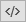

Cell Detector
=============

   An image of cell nuclei before and after executing the Cell Detector addon.

This add-on is designed to take a microscope image of fluorescently labeled cell nucleii and find the coordinates of
every cell.

To use it, open a ClickPoints session and add the add-on ``CellDetector.py`` by clicking on |the script icon|.

Start the cell detector script by using ``F12`` (or the key the script is connected to). All found cell nucleii will
be labeled with a marker.

.. attention::
    The Cell Detector won't work for cells which are too densely clustered. But ClickPoints allows you to review and adjust
    the results if some cells were not detected.

