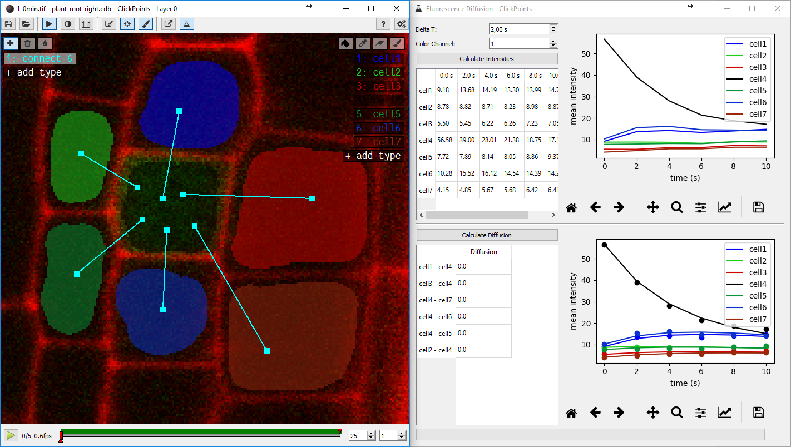

Fluorescence Diffusion
======================

This add-on implements diffusion of florescence proteins between adjacent cells.

The add-on can be used as follows:

1. add the add-on "Fluorescence Diffusion"
2. create a mask-type for each cell (see module :ref:`Mask <mask-define-colors>`_ on creating mask-types)
3. paint the cell area for each cell in each image
4. add line marker of the type "connect" to mark between which cells diffusion is allowed. (Only necessary for the first image)
5. specify the "Delta T", the time between two images
6. specify the image channel to use (0: Red, 1: Green, 2: Blue)
7. click on "Calculate Intensities" to obtain the intensity values for the masked regions
8. click on "Calculate Diffusion" to obtain the diffusion values for the links

1. Add the add-on
-----------------
Open a ClickPoints session and add the add-on ``Fluorescence Diffusion`` by clicking on |the add-on icon|.

2. Create a mask-type for each cell
-----------------------------------
Click on |the mask icon| and select the button "+ add type" to add a mask type for each cell.

3. Paint the cell area for each cell in each image
--------------------------------------------------
Click on the paint brush and the name of the mask-type. Then paint the area of the cell in the image. Use the arrow keys
to navigate through the images and paint the cell in each image. From these regions the green image channel will be
summed as the total fluorescence intensity of the cell at this time.

Repeat this process for all images.

.. seealso::
    For more information on the usage of masks, see the page on :doc:`mask`.

4. Specify the links between cells
----------------------------------
Click on the button "connect" on the left side of the window. Now click on one cell and drag the mouse to another cell
that should be connected to the first cell. Repeat this for all cells you want to link. Links indicate that diffusion
between these cells is allowed and a diffusion value will be fitted for this link later.

Links are only needed in one image of the sequence, not for all images.

.. seealso::
    For more information on the usage of markers, see the page on :doc:`marker`.

5. Specify the time between two images
--------------------------------------
Open the add-on by clicking on |the flask icon|. Add a value for "Delta T", which specifies the time between two subsequent
images in seconds.

6. Specify which image channel to use
-------------------------------------
In the add-on window, specify the value "Color Channel", which specifies which color channel to use: 0: Red, 1: Green, 2: Blue.

7. Calculate Intensities
------------------------
Click in the button "Calculate Intensities". The add-on sums all pixel intensity values for the regions covered by the masks.
The outputs can be seen in the table directly under the button. The graph right of the table shows the intensities over time.

8. Calculate Diffusion
----------------------
Click on the button "Calculate Diffusion". The add-on tries to find diffusion constants, so that the diffusion equation
describes the change of the fluorescence intensities in the cells. The resulting values are printed in the table under
the button and the simulated diffusion are shown in the graph right of the table.

