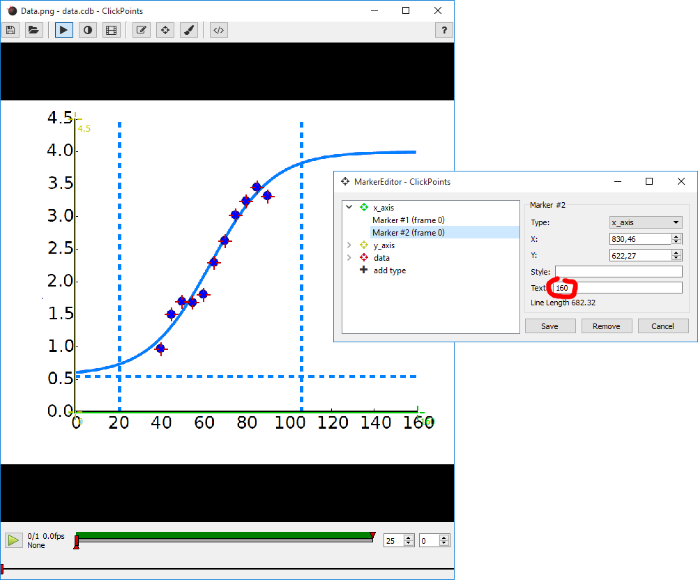

Grab Plot Data
==============

   The two axis are marked with the corresponding markers and the data points with the data markers. The start and end
   points of the axis are assigned a text containing the corresponding axis value.

This addon helps to retrieve data from plots.

To use it, open a ClickPoints session and add the addon ``GrabPlotData.py`` by clicking on |the script icon|.

Sometimes it is useful to extract data from plotted results found in publications to compare them with own results or
simulations. ClickPoints therefore provides the addon "GrabPlotData". It uses three marker types. The types "x_axis" and
"y_axis" should be used to mark the beginning and end of the x and y axis of the plot. Markers should be assigned a text
containing the value which is associated with this point on the axis. These axis markers are used to remap the pixel
coordinates of the "data" markers to the values provided by the axis. These remapped values are stored in a ".txt" file
that has the same name as the image.

.. attention::
    This can only be used if the axe is not scaled logarithmically. Only linear axes are supported.

.. |the script icon| image:: images/IconCode.png