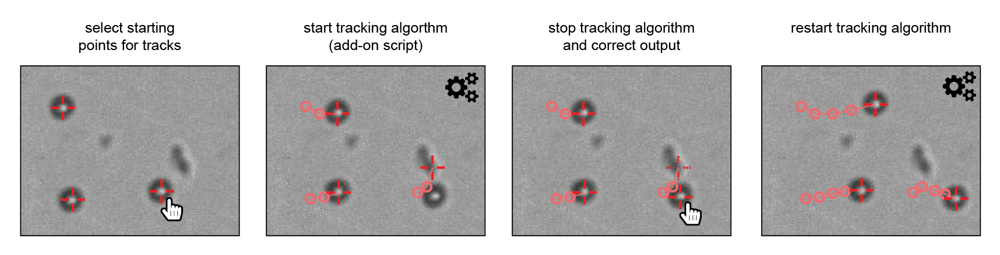

Tracking
========

This add-on takes markers in one image and tries to find the corresponding image parts in the subsequent images.

To use it, open a ClickPoints session and add the add-on ``Track.py`` by clicking on |the script icon|.

Create a marker type with mode TYPE_Track. Mark every object which should be tracked with a marker of this type. Then hit ``F12`` (or the button you
assigned the Track.py to) and watch the objects to be tracked. You can at any point hit the key again to stop the tracking.
If the tracker has made errors, you can move the marker by hand and restart the tracking from the new position.

.. attention::
    If the markers are not in a TYPE_Tracking type, they are not tracked by ``Track.py``. Also maker which already have
    been tracked are only tracked again, if they were moved in ClickPoints.

.. |the script icon| image:: images/IconCode.png