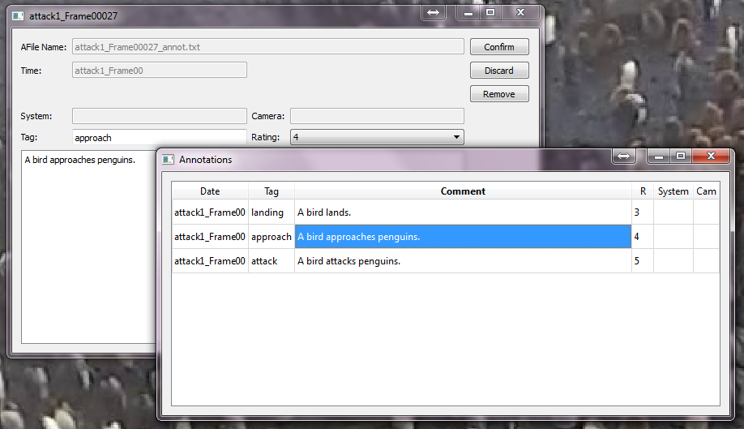

Annotations
===========

A module which allows for single frames to be annotated by a comment.

Basics
------

   Annotation Example

To annotate a frame or edit the annotation of a frame press ``A`` or
|the annotation icon| and fill in the information in the dialog. The
frame will be marked with a red tick in the timeline. To get a list of
all annotated frames press ``Y``. In this list clicking an annotation
results in a jump to the frame of the annotation.

Keys
----

-  A: add/edit annotation
-  Y: show annotation overview

