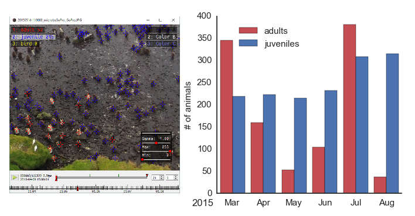

Count Penguins
==============

    Left: image of clickpoints to count penguins. Right: number of penguins counted.

In the example, we show how the ClickPoints can be used to count penguins animals in an image.

The example contains some images recorded with a GoPro Hero 2 camera, located at the Baie du Marin King penguin colony on Possession Island of the Crozet Archipelago :cite:`BohecIPEV`.
Two marker types where added in ClickPoints to count the adult and juvenile animals.

The the counts can be evaluated using a small script:

.. code-block:: python
    :linenos:

    import matplotlib.pyplot as plt
    import clickpoints

    # open database
    db = clickpoints.DataFile("count.cdb")

    # iterate over images
    for index, image in enumerate(db.getImages()):
        # get count of adults in current image
        marker = db.getMarkers(image=image, type="adult")
        plt.bar(index, marker.count(), color='b', width=0.3)

        # get count of juveniles in current image
        marker = db.getMarkers(image=image, type="juvenile")
        plt.bar(index+0.3, marker.count(), color='r', width=0.3)

    # display the plot
    plt.show()

.. rubric:: References

.. bibliography:: refs.bib
   :style: plain
   :filter: docname in docnames
   :labelprefix: C
