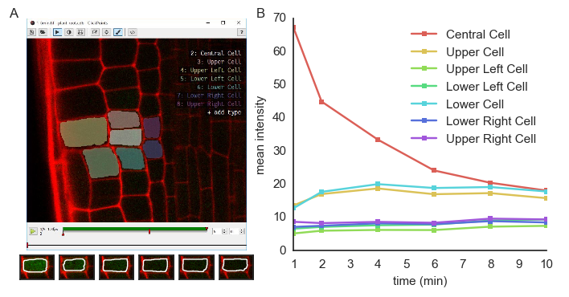

Flourescence intensities in plant roots
=======================================

    Left: image of a plant root in ClickPoints. Right: fluorescence intensities of the cells over time.

In the example, we show how the mask panting feature of ClickPoints can be used to evaluate fluorescence intensities in
microscope recordings.

Images of an *Arabidopsis thaliana* root tip, obtained using a two-photon confocal microscope :cite:`gerliz2016`, recorded at
1 min time intervals are used. The plant roots expressed a photoactivatable green fluorescent protein, which after
activation with a UV pulse diffuses from the activated cells to the neighbouring cells.

For each time step a mask is painted to cover each cell in each time step.

The fluorescence intensities be evaluated using a small script:

.. code-block:: python
    :linenos:

    from __future__ import division, print_function
    import re
    import numpy as np
    from matplotlib import pyplot as plt

    # connect to ClickPoints database
    # database filename is supplied as command line argument when started from ClickPoints
    import clickpoints
    start_frame, database, port = clickpoints.GetCommandLineArgs()
    db = clickpoints.DataFile(database)
    com = clickpoints.Commands(port, catch_terminate_signal=True)

    # get images and mask_types
    images = db.getImages()
    mask_types = db.getMaskTypes()

    # regular expression to get time from filename
    regex = re.compile(r".*(?P<experiment>\d*)-(?P<time>\d*)min")

    # initialize arrays for times and intensities
    times = []
    intensities = []

    # iterate over all images
    for image in images:
        print("Image", image.filename)
        # get time from filename
        time = float(regex.match(image.filename).groupdict()["time"])
        times.append(time)

        # get mask and green channel of image
        mask = image.mask.data
        green_channel = image.data[:, :, 1]

        # sum the pixel intensities for every channel
        intensities.append([np.mean(green_channel[mask == mask_type.index]) for mask_type in mask_types])

    # convert lists to numpy arrays
    intensities = np.array(intensities).T
    times = np.array(times)

    # iterate over cells
    for mask_type, cell_int in zip(mask_types, intensities):
        plt.plot(times, cell_int, "-s", label=mask_type.name)

    # add legend and labels
    plt.legend()
    plt.xlabel("time (min)")
    plt.ylabel("mean intensity")
    # display the plot
    plt.show()

.. rubric:: References

.. bibliography:: refs.bib
   :style: plain
   :filter: docname in docnames
   :labelprefix: B
