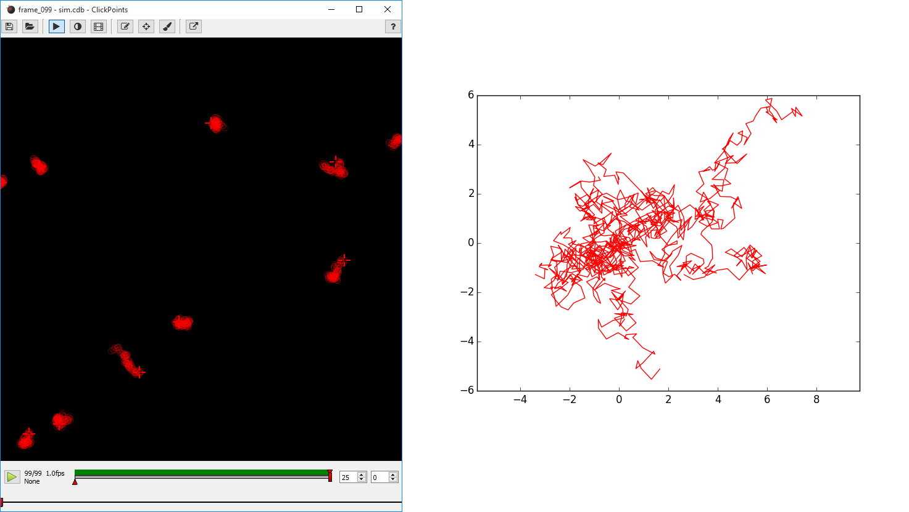

Using ClickPoints for Visualizing Simulation Results
====================================================

    Left: Tracks of the random walk simulation in ClickPoints. Right: Tracks plotted all starting from (0, 0).

Here we show how ClickPoints can be apart from viewing and analyzing images also be used to store simulation results
in a ClickPoints Project file. This has the advantages that the simulation can later be viewed in ClickPoints, with all
the features of playback, zooming and panning. Also the coordinates of the objects used in the simulation can later be
accessed through the ClickPoints Project file.

This simple example simulates the movement of 10 object which follow a random walk.

.. code-block:: python
    :linenos:

    import matplotlib.pyplot as plt
    import numpy as np
    import clickpoints
    import io

    # Simulation parameters
    N = 10
    size = 100
    size = 100
    frame_count = 100

    # create new database
    db = clickpoints.DataFile("sim.cdb", "w")

    # Create a new marker type
    type_point = db.AddType("point", "#FF0000", mode=db.TYPE_Track)

    # Create track instances
    tracks = db.AddTracks(N, type_point)

    # Create initial positions
    points = np.random.rand(N, 2)*size

    # iterate
    for i in range(frame_count):
        print(i)
        # Create a new frame
        image = db.AddImage("frame_%03d" % i, "", "", width=size, height=size)

        # Move the positions
        points += np.random.rand(N, 2)-0.5

        # Save the new positions
        db.SetMarker(image=image, x=points[:, 0], y=points[:, 1], track=tracks)

    # plot the results
    for track in tracks:
        plt.plot(track.points[:, 0], track.points[:, 1], '-')
    plt.xlim(0, size)
    plt.ylim(size, 0)
    plt.show()

