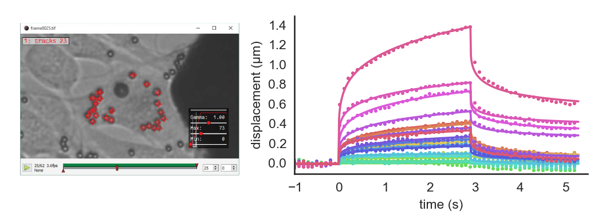

Supervised Tracking of Fiducial Markers in Magnetic Tweezer Measurements
========================================================================

   Left: the image of beads on cells loaded in ClickPoints. Right: displacement of beads.

In the example, we show how the ClickPoints addon ``Track.py`` can be used to track objects in an image and how the
resulting tracks can later on be used to calculate displacements.

The data we show in this example are measurements of a magnetic tweezer, which uses a magnetic field to apply forces on
cells. The cell is additionally tagged with non magnetic beads, with are used as fiducial markers.

The images can be opened with ClickPoints and every small bead (the fiducial markers) is marked with a marker of type
``tracks``. Then the ``Track.py`` addon is started to finde the position of these beads in the subsequent images.

The tracks can then be evaluated using a small script:

.. code-block:: python
    :linenos:

    import numpy as np
    import matplotlib.pyplot as plt

    # connect to ClickPoints database
    # database filename is supplied as command line argument when started from ClickPoints
    import clickpoints
    db = clickpoints.DataFile()

    # get all tracks
    tracks = db.GetTracks()

    # iterate over all tracks
    for track in tracks:
        # get the points
        points = track.points()
        # calculate the distance to the first point
        distance = np.linalg.norm(points[:, :] - points[0, :], axis=1)
        # plot the displacement
        plt.plot(distance, "-o")

    # show the plot
    plt.xlabel("# frame")
    plt.ylabel("displacement (pixel)")
    plt.show()
