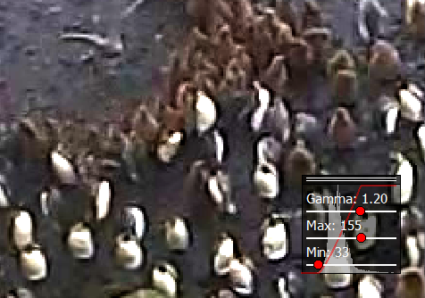
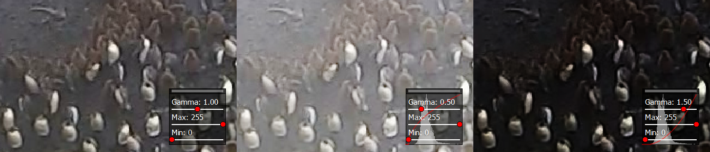
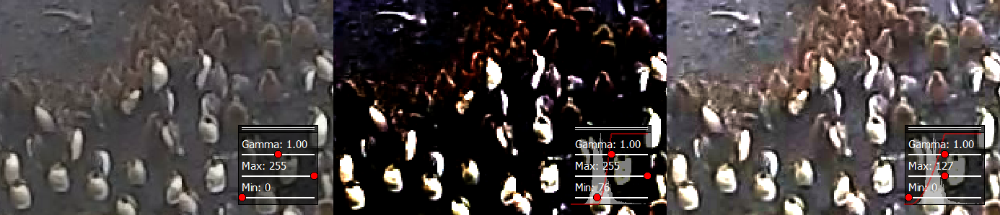

GammaCorrection
===============

   An example gamma correction.

The gamma correction is a slider box in the right bottom corner which allows to change the brightness and gamma of the
currently displayed image. It can be opened by clicking on |the adjust icon|.

The box in the bottom right corner shows the current gamma and brightness adjustment. Moving a slider changes the
display of the currently selected region in the images. The background of the box displays a histogram of brightness
values of the current image region and a red line denoting the histogram transform given by the gamma and brightness
adjustment. Pressing ``update`` the key ``G`` sets the currently visible region of the image as the active region for
the adjustment. Especially for large images it increases performance significantly if only a portion of the
image is adjusted. A click on ``reset`` resets gamma and brightness adjustments.

Gamma
-----

   The same image for different gamma values or 1, 0.5 and 1.5.

The gamma value changes how bright and dark regions of the images are
treated. A low gamma value (<1) brightens the dark regions up while
leaving the bright regions as they are. A high gamma value (>1) darkens
the dark regions of the image while leaving the bright regions as they
are.

Brightness
----------

   The same image for different brightness values, where once the lower and once the upper range was adjusted.

The brightness can be adjusted by selecting the Max and Min values.
Increasing the Min value darkens the image by setting the Min value (and
everything below) to zero intensity. Decreasing the Max value brightens
the image by setting the Max value (and everything above) to maximum
intensity.

Keys
----

-  G: update rect

