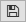

General
=======

Once ClickPoints has been :doc:`installed <installation>` it can be started directly from the Start Menu/Program launcher.

This will open ClickPoints with an empty project.

Images can be added to the project by using |the folder button|.

The project can be saved by clicking on |the save button|.

ClickPoints can also be used to directly open images, videos or folder by right clicking on them, which will open an
unsaved project which already contains some images. This way ClickPoints functions as an image viewing tool.

ClickPoints can be opened with various files as target:

-  an **image**, loading all images in the folder of the target image.
-  a **video** file, loading only this video.
-  a **folder**, loading all image and video files of the folder and its sub folders, which are concatenated to one single image stream.
-  a previously saved ``.cdb`` **ClickPoints Project** file, loading the project as it was saved.

Pressing ``Esc`` closes ClickPoints.

To easily access marker, masks, track or other information, stored in the ``.cdb`` ClickPoints Project file,
we provide a python based :doc:`API`

.. attention::
    If you plan to evaluate your data set or continue working on the same data set you must save the project -
    otherwise all changes will be lost upon closing the program. If a project was saved, all changes are saved
    automatically upon frame change or  by pressing ``S``

.. _zooming-panning-rotating

Zooming, Panning, Rotating
--------------------------

ClickPoints opens with a display of the current image fit to the window. The display can be

- zoomed, using the mouse wheel
- panned, holding down the right mouse button
- rotated using ``R``.

To fit the image into the window press ``F`` and switch to full screen mode by pressing ``W``.

.. note::
    Default rotation on startup or and rotation steps with each press of ``R`` can be defined in the
    ``ConfigClickPoints.txt`` with the entries ``rotation =`` and ``rotation_steps =``.

.. _jumping_frames:

Jumping frames
--------------

ClickPoints provides various options to change the current frame.

- The keys ``Left`` and ``Right`` go to the previous or next frame.
- The keys ``Home`` and ``End`` jump to the first or last frame.
- Click or Drag & Drop the :doc:`timeline`  slider

Key pairs on the numpad allow for jumps of speciefied

- ``Numpad 2``, ``Numpad 3``:  -/+ 1
- ``Numpad 5``, ``Numpad 6``:  -/+ 10
- ``Numpad 8``, ``Numpad 9``:  -/+ 100
- ``Numpad /``, ``Numpad *``:  -/+ 1000

Be sure to have the numpad activated, or the keys won't work.

.. note::
    The step size of the jump keys can be redefined by the ``jumps =`` variable in the ``ConfigClickPoints.txt``

For continuous playback of frames see :doc:`timeline` module.

Interfaces
----------

The interfaces for Marker, Mask and GammaCorretion can be shown/hidden
pressing ``F2``.

.. |the folder button| image:: images/IconFolder.png

