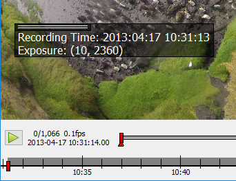

Info Hud
========

    Example of the info hud displaying time and exposure exif data from a jpg file.

This info hud can display additional information for each image. Information can be obtained from the filename, jpeg exif
information or tiff metadata or be provided by an external script.

The text can be set using the options dialog. Placeholders for additional information are written with curly brackets ``{}``.
The keyword from the source (``regex``, ``exif`` or ``meta``) is followed by the name of the information in brackets ``[]``, e.g.
``{exif[rating]}``. If the text is set to ``@script`` the info hud can be filled using an external script.
Use ``\n`` to start a new line.

To extract data from the filename a regular expression with named fields has to be provided.

Examples
--------

Data from filename
~~~~~~~~~~~~~~~~~~

.. code-block:: python

    file: "penguins_5min.jpg"

    Info Text: "Animal: {regex[animal]} Time: {regex[time]}"
    Filename Regex: '(?P<animal>.+?[^_])_(?P<time>.+)min'

    Output: "Animal: penguin Time: 5"

Data from exif
~~~~~~~~~~~~~~

.. code-block:: python

    file: "P1000236.jpg"

    Info Text: "Recording Time: {exif[DateTime]} Exposure: {exif[ExposureTime]}"

    Output: "Recording Time: 2016:09:13 10:31:13 Exposure: (10, 2360)"

The keys can be any field of the jpeg exif header as e.g. shown at http://www.exiv2.org/tags.html

Data from meta
~~~~~~~~~~~~~~

.. code-block:: python

    file: "20160913_134103.tif"

    Info Text: "Magnification: {meta[magnification]} PixelSize: {meta[pixelsize]}"

    Output: "Magnification: 10 PixelSize: 6.45"

The values presented in the meta field of tiff files varies by the tiff writer. ClickPoints can only access tiff meta data
written in the json format in the tiff meta header field, as done by the ``tifffile`` python package.

Data from script
~~~~~~~~~~~~~~~~

.. code-block:: python

    Info Text: "@script"

and a script file listening to the ``PreLoadImageEvent`` should set the text with ``com.updateHUD``. This script should be
started via the script launcher and could look like this:

.. code-block:: python
    :linenos:

    from __future__ import print_function, division
    import os
    import numpy as np
    import socket
    import select

    import clickpoints

    start_frame, database, port = clickpoints.GetCommandLineArgs()
    com = clickpoints.Commands(port, catch_terminate_signal=True)

    def displayMetaInfo(ans):
        # print('in function:',ans)
        command, fullname, framenr = ans[0].split(' ', 2)
        fpath, fname = os.path.split(fullname)
        com.updateHUD(framenr+" "+fullname)

    # input
    HOST = "localhost"
    PORT = port
    BROADCAST_PORT = PORT + 1

    # broadcast socket to listen to
    sock = socket.socket(socket.AF_INET, socket.SOCK_DGRAM)
    sock.setblocking(0)
    sock.bind(('127.0.0.1', BROADCAST_PORT))

    last_img_nr = -1
    # main loop
    while True:
        ready_to_read, ready_to_write, in_error = select.select([sock], [], [], 0)

        # wait for incomming signal
        if ready_to_read:
            ans = sock.recvfrom(1024)

            # split information
            img_nr = np.int(ans[0].split()[2])

            if ans[0].startswith('PreLoadImageEvent') and img_nr != last_img_nr:
                # print("nr is:",img_nr)
                displayMetaInfo(ans)
                last_img_nr = img_nr

                # annoying buffer part
                # read out and thereby delete all remaining entries
                last_message = ""
                messages_pending = False
                ready_to_read, ready_to_write, in_error = select.select([sock], [], [], 0)
                if ready_to_read:
                    messages_pending = True
                    while messages_pending:
                        ready_to_read, ready_to_write, in_error = select.select([sock], [], [], 0)
                        # clear incomming buffer
                        if ready_to_read:
                            tmp = sock.recvfrom(1024)
                            # print('message pending', tmp)
                            if tmp[0].startswith('PreLoadImageEvent'):
                                last_message = tmp
                                # print('lastmsg:',last_message)
                        else:
                            messages_pending = False
                            # make sure last message is displayed
                            if not last_message == ans and not last_message == '' and img_nr != last_img_nr:
                                print("reached this")
                                displayMetaInfo(last_message)
                                last_message = ''
                                last_img_nr = img_nr