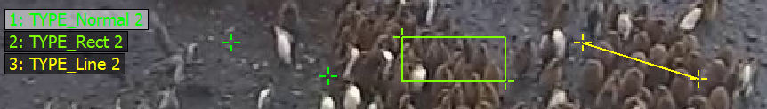
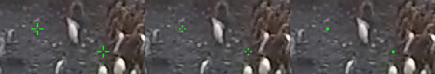
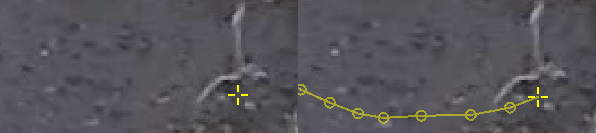
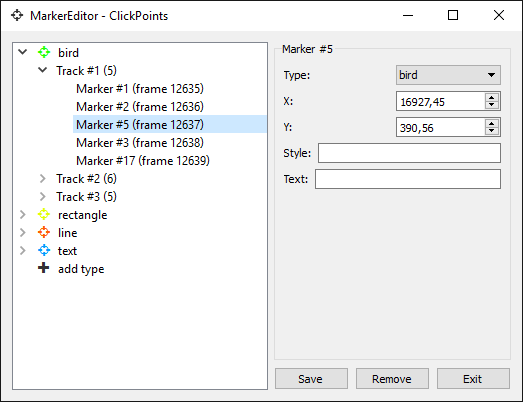
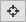
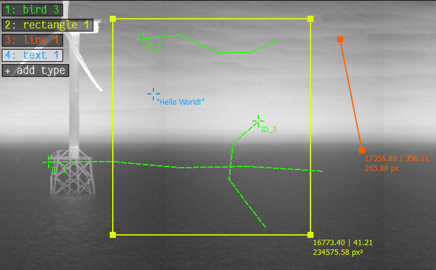

Marker
======

.. figure:: images/ModulesMarker.png
   :alt: Marker Example

   An example image showing three different marker types and some markers placed on the image.

Marker are added to a frame to refer to pixel positions. Marker can have different types to mark different objects.
They can also be used in tracking mode to recognize an object over different frames.

The marker editor can be opened by clicking on |the marker icon|.

The list of available markers is displayed at the top left corner. A marker type can be selected either by clicking on
its name or by pressing the corresponding number key. A left click in the image places a new marker of the currently
selected type. Existing markers can be dragged with the left mouse button and deleted by clicking on them while
holding the control key.

To save the markers press ``S`` or change to the next image, which automatically saves the current markers.

Marker types
------------

A right click on any marker or type opens the Marker Editor window. There types can be created, modified or deleted.

Marker types have a name, which is displayed in the HUD, a color and a mode.

   Different marker type modes.

TYPE_Normal results in single markers. TYPE_Rect joins every two consecutive markers as a rectangle. TYPE_Line joins
every two consecutive markers as a line. TYPE_Track specifies that this markers should use tracking mode (see section
Tracking Mode).

Marker display
--------------

Pressing ``T`` toggles between three different marker displays. If the smallest size is selected, the markers can't be
moved. This makes it easier to work with a lot of markers on a small area.

   The same marker in different size configurations.

Tracking mode
-------------

Often objects which occur in one image also occur in another image (e.g. the images are part of a video). Then it is
necessary to make a connection between the object in the first image and the object in the second image. Therefore
ClickPoints features a tracking mode, where markers can be associated between images. It can be enabled using the
TYPE\_Track for a marker type. The following images displays the difference between normal mode (left) and tracking
mode (right):

   The same marker in normal mode (left) and in tracking mode (right). The track always displays all previous positions
   connected with a line, when they are from two consecutive images.

To start a track, mark the object in the first image. Then switch to the next image and the marker from the first image
will still be displayed but only half transparent. To add a second point to the track grab the marker and move it to the
new position of the object. Continue this process through the images where you want to track the object. If the object
didn't move from the last frame or isn't visible, an image can be left out, which results in a gap in the track. To
remove a point from the track, click it while holding control.

Marker Editor
-------------

The Marker Editor is used to manage marker types. New marker types can be created, existing ones can be modified or
deleted.

   The Marker Editor used to create and change marker types, navigate to tracks and marks and delete marker,
   tracks and types

**Creating Marker Types**
    To create a new marker type open the marke editor via |the marker icon| or right click on the marker display or a marker.
    Select the ``+add type`` field, enter a name, set the marker mode to marker, line, rectangle or track and choose a color.
    Further modifications can be achieved via the text and style field, for more details see the following sections.

**Editing Marker Types**
    To edit a marker type, simply select the type from the menu, chenges the desired values and save the changes by pressing ``Save``

    .. note::
        It is NOT possible to change marker types as long as marker objects of this type exist. E.g. you can't make lines out
        of regular markers as they don't have a second point.

**Navigation**
    The editor can also be used to navigate. Selecting a marker will bring you to the frame the marker is placed in.
    By clicking on the arrow in front of the type name the marker or track overview unfolds. Selecting a marker of a track
    will bring you to the frame it is placed in.

**Deleting Types, Tracks and Markers**
    Types, tracks and markers can be removed by selecting the object in the tree and pressing the ``Remove`` button.
    By removing a marker type all markers and tracks of this type are removed, removing a track will remove all markers
    of this track.

    .. warning::
        There is no undo button!

Marker Style Definitions
------------------------

Style definitions can provide additional features to change the appearance of marker. They are inherited from the marker
type to the track and from the track to the marker itself. If no track is present the marker inherits its style
directly from the type. This allows to define type, track and marker specific styles.

Styles can be set using the Marker Editor (right click on any marker or type).

The styles use the JSON format for data storage. The following fields can be used:

-  **Marker Color** - ``"color": "#FF0000"``
      Defines the color of the marker in hex format.
      Color can also be a ``matplotlib`` colormap followed optionally by a
      number (e.g. ``jet(30)``), then that many colors (default 100) are
      extracted from the color map and used for the marker/tracks to color
      every marker/track differently.

-  **Marker Shape** -  ``"shape": "cross"``
      Defines the shape of the marker.

      *values:* ``cross`` (default), ``circle``, ``rect``

-  **Marker Line Width** - ``"line-width": 1``
      Defines the line width of the markers symbol (e.g. width of the circle). Ignored if a filled symbol (e.g. the
      cross) is used.

-  **Marker Scale** - ``"scale": 1``
      Scaling of the marker.

-  **Track Line Style** - ``"track-line-style": "solid"``
      The style of the line used to display the track history.

      *values:* ``solid`` (default), ``dash``, ``dot``, ``dashdot``, ``dashdotdot``

-  **Track Line Width** - ``"track-line-width": 2``
      The line width of the line used to display the track history.

-  **Track Gap Line Style** -- ``"track-gap-line-style": dash``
      The style of the line used to display gaps in the track history.

      *values:* ``solid``, ``dash`` (default), ``dot``, ``dashdot``, ``dashdotdot``

-  **Track Gap Line Width** -- ``"track-gap-line-width": 2``
      The line width of the line used to display gaps in the track history.

-  **Track Marker Shape** - ``"track-point-shape": "circle"``
      The marker shape used to display the track history.

      *values:* ``circle`` (default), ``rect``, ``cross``, ``none``

-  **Track Marker Scale** - ``"track-point-scale": 1``
      The scaling of markers used to display the track history.

**Style Examples:**

.. code-block:: python

   {"color": "jet(30)"}  # style for providing a marker type with 30 different colors
   {"track-line-style": "dash", "track-point-shape": "none"}  # change the track style

Marker Text & SmartText
------------------------

The text field allows to attache text to marker, line, rectangle and track objects.
Text properties are inherited from the marker type to the track and from the track to the marker itself.
If no track is present the marker inherits its text directly from the type.
This allows to define type, track and marker specific texts.

Text can be set using the Marker Editor (right click on any marker or type).

ClickPoints provides a SmartText feature, enabling the display of self updating text in to display pre defined values.
SmartText keyword always start with a ``$`` character.
The keywords are depending on the type for marker, as explained in the following overview:

**General**
    ``/n``
        insert a new line

    ``$marker_id``
        inserts the id of the ``marker``, ``line`` or ``rectangle`` object

    ``$x_pos``
        inserts the x position of the ``marker``, first marker of a ``line`` or top left marker of a ``rectangle``

    ``$y_pos``
        inserts the x position of the ``marker``, first marker of a ``line`` or top left marker of a ``rectangle``

**Line**
    ``$length``
        inserts the length of the ``line`` in pixel with 2 decimals.

**Rectangle**
    ``$area``
        inserts the area of the ``rectangle`` in pixel with 2 decimals.

**Track**
    ``$track_id``
        inserts the track id of the track.

**Text Examples:**

.. code-block:: python

   # regular Text
   Marker: "Hello World!"                              # shows the text Hello World!

   # SmartText
   Track: "ID_$track_id"                               # shows the track ID
   Line: "$x_pos | $y_pos \n$length px"                # shows the x & y coordinate and length
   Rect: "ID_$marker_id\n$x_pos | $y_pos \n$area px�"  # shows the object_id, its x & y coordinate and area

    Using regular text and SmartText features for lines, rectangles and tracks

