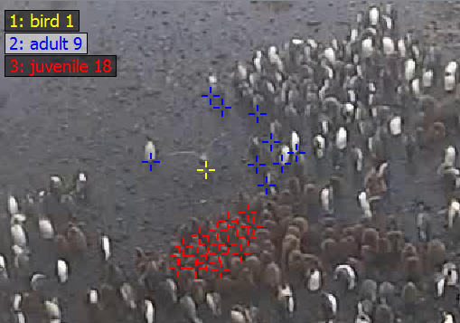

Marker
======

   An example image showing three different marker types and some markers placed on the image.

Marker are added to a frame to refer to pixel positions. Marker can have different types to mark different objects.
They can also be used in tracking mode to recognize an object over different frames.

The marker editor can be opened by clicking on |the marker icon|.

The list of available markers is displayed at the top left corner. A marker type can be selected either by clicking on
its name or by pressing the corresponding number key. A left click in the image places a new marker of the currently
selected type. Existing markers can be dragged with the left mouse button and deleted by clicking on them while
holding the control key.

To save the markers press ``S`` or change to the next image, which automatically saves the current markers.

Marker types
------------

A right click on any marker or type opens the Marker Editor window. There types can be created, modified or deleted.

Marker types have a name, which is displayed in the HUD, a color and a mode.

.. figure:: images/ModulesMarkerTypes.png
   :alt: Marker Type Modes

   Different marker type modes.

TYPE_Normal results in single markers. TYPE_Rect joins every two consecutive markers as a rectangle. TYPE_Line joins
every two consecutive markers as a line. TYPE_Track specifies that this markers should use tracking mode (see section
Tracking Mode).

Marker display
--------------

Pressing ``T`` toggles between three different marker displays. If the smallest size is selected, the markers can't be
moved. This makes it easier to work with a lot of markers on a small area.

.. figure:: images/ModulesMarkerSizes.png
   :alt: Marker Sizes

   The same marker in different size configurations.

Tracking mode
-------------

Often objects which occur in one image also occur in another image (e.g. the images are part of a video). Then it is
necessary to make a connection between the object in the first image and the object in the second image. Therefore
ClickPoints features a tracking mode, where markers can be associated between images. It can be enabled using the
TYPE\_Track for a marker type. The following images displays the difference between normal mode (left) and tracking
mode (right):

.. figure:: images/ModulesMarkerTracking.png
   :alt: Marker Sizes

   The same marker in normal mode (left) and in tracking mode (right). The track always displays all previous positions
   connected with a line, when they are from two consecutive images.

To start a track, mark the object in the first image. Then switch to the next image and the marker from the first image
will still be displayed but only half transparent. To add a second point to the track grab the marker and move it to the
new position of the object. Continue this process through the images where you want to track the object. If the object
didn't move from the last frame or isn't visible, an image can be left out, which results in a gap in the track. To
remove a point from the track, click it while holding control in the image you want to delete the point.

Marker Style Definitions
------------------------

Style definitions can provide additional features to change the appearance of marker. They are inherited from the marker
type to the track and from the track to the marker itself. If no track is present the marker inherits its style
directly from the type. This allows to define type, track and marker specific styles.

Styles can be set using the Marker Editor (right click on any marker or type).

The styles use the JSON format for data storage. The following fields can be used:

-  ``"color": "#FF0000"`` defines the color of the marker in hex format.
   Color can also be a ``matplotlib`` colormap followed optionally by a
   number (e.g. ``jet(30)``), then that many colors (default 100) are
   extracted from the color map and used for the marker/tracks to color
   every marker/track differently.
-  ``"shape": "cross"`` defines the shape of the marker. Allowed values
   are ``cross`` (default), ``circle``
-  ``"line-width": 1`` defines the line width of the markers symbol
   (e.g. width of the circle). Ignored if a filled symbol (e.g. the
   cross) is used.
-  ``"scale": 1`` how much to scale the marker

-  ``"track-line-style": "solid"`` the type of the line in track display
   can be ``solid`` (default), ``dash``, ``dot``, ``dashdot``,
   ``dashdotdot``
-  ``"track-line-width": 2`` the line width of the line in track display
-  ``"track-point-shape": "circle"`` the symbol used to display track
   points, can be ``circle`` (default), ``rect``, ``none``
-  ``"track-point-scale": 1`` the scaling for the symbols used to
   display the track points

Style Examples:

.. code-block:: python

   {"color": "jet(30)"}  # style for providing a marker type with 30 different colors
   {"track-line-style": "dash", "track-point-shape": "none"}  # change the track style

.. |the marker icon| image:: images/IconMarker.png

