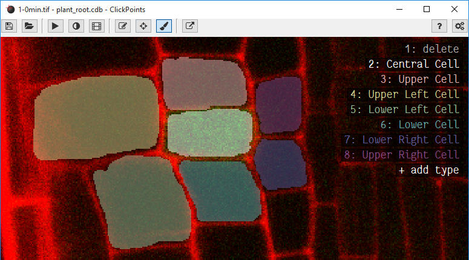

Mask
====

   An image where 7 regions have been marked with different masks.

A mask can be painted to mark regions in the image with a paint brush. The mask editor can be opened by clicking on
|the mask icon|.

A list of available mask colors is displayed in the top right corner. Switching to paint mode can be done using the key
``P``, pressing it again switches back to marker mode. Colors can be selected by clicking on its name or pressing the
corresponding number key. Holding the left mouse button down draws a line in the mask using the selected color. To
save the mask press ``S`` or change to the next image, which automatically saves the current mask.
The mask type ``delete`` acts as an eraser and allows to remove labeled regions.

Define colors
-------------

A right click on a color name opens the mask editor menu, which allows the creation, modification and deletion of mask
types. Every mask type consists of a name and a color.

Brush size
----------

The brush radius can be de- and increased using the keys ``-`` and ``+``.

Color picker
------------

The color can alternatively to selection via number buttons or a click on the names be selected by using ``K`` to select
the color which is currently below the cursor.

Mask transparency
-----------------

The transparency of the mask can be adjusted with the keys ``I`` and ``O``.

Mask update
-----------

Updating masks can be slow if the images are very large. To enable fast painting of large masks, ClickPoints can disable
the automatic updates of the mask by disabling the option ``Auto Mask Update``. If automatic updates are disabled
the key ``M`` redraws the currently displayed mask.

Config Parameter
----------------

-  ``auto_mask_update =`` whether to update the mask display after each stroke or manually by key press
-  ``draw_types = [[0,[255,0,0]]`` specifies what categories to use for
   mask drawing. Every category is an array with two entries: index and color.

Keys
----

-  0-9: change brush type
-  K: pick color of brush
-  -: decrease brush radius
-  +: increase brush radius
-  O: increase mask transparency
-  I: decrease mask transparency
-  M: redraw the mask

.. |the mask icon| image:: images/IconMask.png

