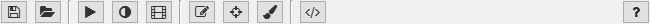

Modules
=======

The modules are the different functions of the ClickPoints program. They can be accessed by the icons in the upper panel.

   The icon panel where all modules can be accessed.

.. toctree::
   :caption: List of Modules
   :maxdepth: 1
   
   timeline
   gammacorrection
   videoexporter
   annotations
   marker
   mask
