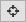

Tracking
========
This recepies gives a shot introduction how to get started manually labeling your own tracks,
for a quick evaluation or groundtruths for the evaluation of automated algorithms.

Getting started
---------------

1. Open the image sequence or video(s) in ClickPoints
***************************************************

   For example: right click on the folder containing your images and select ClickPoints on the context menue

2. Save the project
*******************************

   Marked results and correlated images must be stored some where, there for the project hast to be named and saved.
   Click on the save button |the save button| and select a storage location and file name.

   .. note::

        Reference to images and video is stored relative as long a the files reside parallel or below in the path tree.
        If the files reside above or on a different branch, drive, or network location, the absolut path is stored.

3. Define Marker types
**********************

    Before we can get started we have to specify a marker type. Marker types are like classes of objects, e.g. we might use
    a class for birds and another one for ships. Every marker type can have multible tracks.

    To open the marker menu either press ``F2`` or click on the Marker button |the marker button| to switch to edit mode (Fig. A).
    Then right click onto the marker list to open the marker menue (Fig. B). You can reuse the default marker or create a new marker
    by selecting ``+ add type``. Choose a name and color for your new marker type and make sure to set the type to ``TYPE_track``.
    Confirm your changes by pressing ``save``.
    To add more tracking types select  ``+ add type`` and repeat the procedure.

    .. figure:: images/recipes_tracking_marker.png
       :alt: Defining a marker for tracking
       :scale: 60%

       Defining a marker for tracking

4. Navigating the dataset
*************************
    * Navigating the current frame:

        ``right mouse button (hold)`` - to pan the image

        ``mouse wheel`` - zoom the image

        ``F`` - fit to view

        ``W`` - full screen mode

        ``H`` - hide time line

    * Navigating the dataset:

    	``left`` & ``right`` cursor keys to go one frame forward and backward

        * Jump a specified set of frames with the numbad keys. See `Jumping Frames <general.html#jumping-frames>`_

        * Use the frame and time navigation slider to by clicking or dragging the cursor to the desired position.

        * Jump to a specific frame by clicking on the frame counter and entering the desired frame number

        * Press |the play icon| to play the dataset with the specifed frame rate or as fast as feasible.

.. note::
	Due to the sequential compression of videos, traversing a video backwards is computational expensive. ClickPoints provides a
	buffer so that the last N frames are stored and can be retrieved without any further computational cost. The default buffer size
	can be specified in the config.

.. warning::
	Be carefull not to reserve too much RAM for the frame buffer as it will drastically reduce performance!

.. |the save button| image:: images/IconSave.png

.. |the play icon| image:: images/IconPlay.png