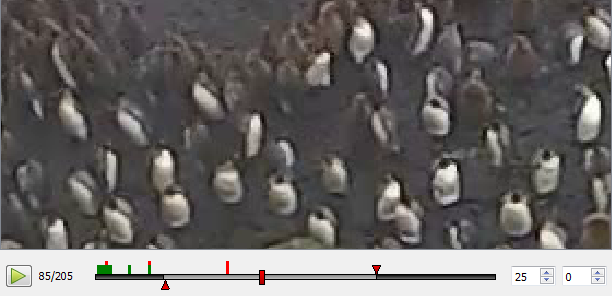
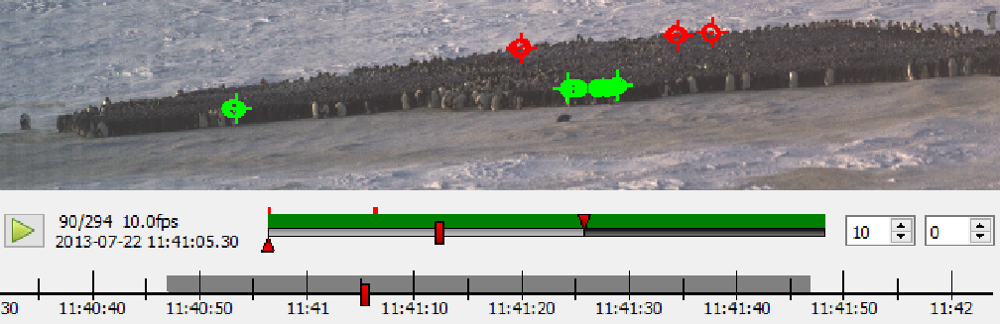

Timeline
========
ClickPoints provides two timelines for navigation, a frame based and a timestamp based timeline. The frame based timeline
is used by default, the timestamp timeline can be activated if time information of the displayed files is available.
Time information extraction is implemented for the filename, the EXIF or TIFF headers.

Frame Timeline
--------------

   Frame Timeline example showing tick marks for marker and annotations.

The timeline is an interface at the bottom of the screen which displays range of currently loaded frames and allows for
navigation through these frames. It can be displayed by clicking on |the play icon|.

To start/stop playback use the playback button at the left of the timeline or press ``Space``. The label next to
it displays which frame is currently displayed and how many frames the frame list has in total.
The time bar has one slider to denote the currently selected frame and two triangular marker to select start and
end frame of the playback. The keys ``b`` and ``n`` set the start/end marker to the current frame.
The two tick boxes at the right contain the current frame rate and the number of frames to skip during playback
between each frame.
To go directly to a desired frame simply click on the frame display (left) and enter the frame number.

Each frame which has selected marker or masks is marked with a green tick mark (see `Marker <marker.html>`_ and
`Mask <mask.html>`_) and each frame marked with an annotation (see `Annotations <annotations.html>`_) is marked with a
red tick. To jump to the next annotated frame press ``Ctrl``\ +\ ``Left`` or ``Ctrl``\ +\ ``Right``.

Config Parameter
****************

-  ``fps =`` (int, value)
        if not 0 overwrite the frame rate of the video
-  ``play_start =`` (float)
        -  > 1: at which frame to start playback  at what

        -  0 > value < 1: fraction of the video to start playback
-  ``play_end =``
        -  > 1: at which frame to start playback  at what

        -  0 > value < 1: fraction of the video to start playback
-  ``playing =`` (bool)
        whether to start playback at the program start

-  ``timeline_hide =`` (bool)
        whether to hide the timeline at the program start

Keys
****

-  ``H`` -  hide control elements
-  ``Space`` - run/pause
-  ``Crtl`` + ``Left`` -  previous image with marker or annotation
-  ``Ctrl`` + ``Right`` - nextimage with marker or annotation

Date Timeline
------------------

   Timestamp Timeline example

The date timeline displays the timestamps of the loaded data set.
To navigate to desired time point simply drag the current position marker or click on the point on the date timeline.
The timeline can be panned and zoomed by holding the left mouse button (pan) und the mouse wheel (zoom).
It aims to make it easier to get an idea of the time distribution of the data set,
to find sections of missing data and facilitate  navigation by a more meaningful metric than frames.

The extraction of timestamps by filename is fast than by EXIF. If you plan to repeatedly open files, without using
a ``.cdb`` to store the time stamps, renaming them once might be beneficial.
A list of timestamp search strings can be specified in the confing file as shown in the code example below. As the
search will be canceled after the first match it is necessary to order the the search strings by decreasing complexity.

Recommended naming template: ``%Y%m%d-%H%M%S-%f_Location_Camera.type``

Config Parameter
****************

-  ``datetimeline_show =``  (bool)
        enable or disable the date timeline by setting this value to True or False
-  ``timestamp_formats =``  (list of strings)
        list of match strings for images, with decreasing complexity
-  ``timestamp_formats2 =`` (list of strings)
        list of match strings for videos with 2 timestamps, with decreasing complexity

    .. code-block:: python

        # default values:
        # for image formats with 1 timestamp
        timestamp_formats = [r'%Y%m%d-%H%M%S-%f',   # e.g. 20160531-120011-2  with fraction of second
                             r'%Y%m%d-%H%M%S']      # e.g. 20160531-120011
        # for video formats with 2 timestamps (start & end)
        timestamp_formats2 = [r'%Y%m%d-%H%M%S_%Y%m%d-%H%M%S']