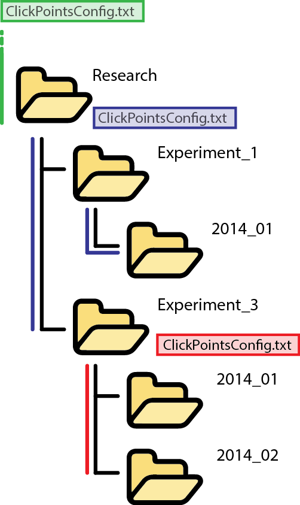

Using ConfigFiles
=================
The config file contains parameters to adjust ClickPoints to the users needs,
adjusts default behaviour or configure key bindings. A GUI is available to
set parameters during runtime, the ConfigFile is used to set default behaviour.

Scope
-----

Config files in ClickPoints are designed to optimize the work flow.
Upon opening a file the path structure is searched for the first occurrence of a valid config file.
Thereby allowing the user to specify default for files grouped in one location.

If no config file is found, the default config values as set in click points base path are used (green).
A config file located in the path "research" (blue) will overwrite these values and is used for files opened in child paths.
Allowing the user to define a preferred setup. In addition we can add a second config file lower in the path tree to specify
a specific setup for all files that were stored under "Experiment_3". This can contain a set of default marker names,
which features to use or which add-ons to include.

   Scope of ConfigFiles

.. note::

   A graphical user interface to view and change config values is available too.

