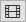

VideoExporter
=============

Exporting parts of the currently loaded images as a video, image
sequence of gif file.

Basics
------

Pressing ``z`` or clicking on |the video icon| opens an interface which allows to select an output
filename for a video, an image sequence (which has to contain a %d
number placeholder) or a gif file. Frames are exported starting from the
start marker in the timeline to the end marker in the timeline. The
framerate is also taken from the timeline. Images are cropped according
to the current visible image part in the main window.

Config Parameter
----------------

Keys
----

-  Z: Export Video

